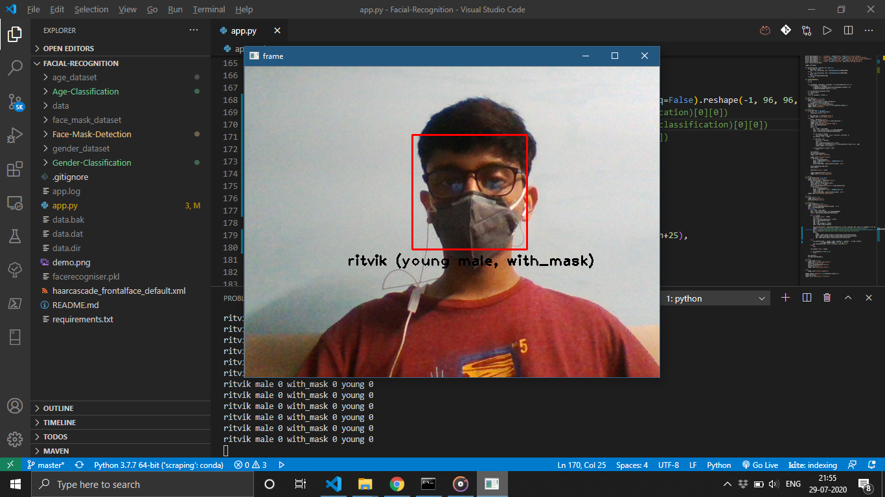
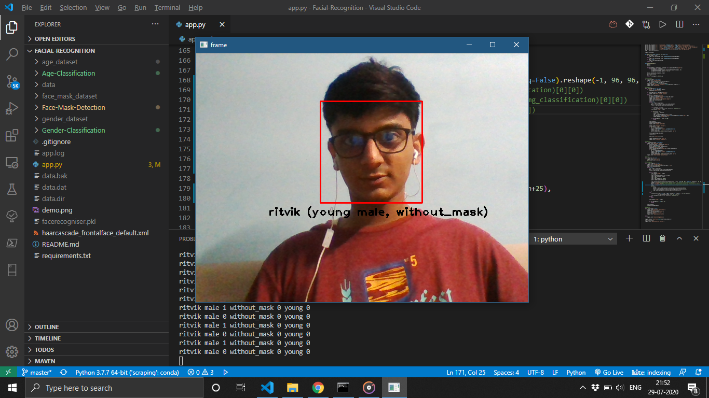

# Facial-Recognition

Commandline Interface based basic Face Recognition System

Additional Features:
* Age Group Classification
* Face Mask Detection
* Gender Classification

<pre>
Face Recognition System

usage: app.py [-h] [-a name] [-c path] [-d name] [-l] [-r] [-x]

optional arguments:
  -h, --help            show this help message and exit
  -a name, --add-face name
                        name of the person to recognise
  -c path, --configure path
                        path to store cascade
  -d name, --delete-face name
                        name of the person to delete
  -l, --list            list out the faces the app recognises
  -r, --recognise       recognise the face
  -x, --reset           reset the application
</pre>  

